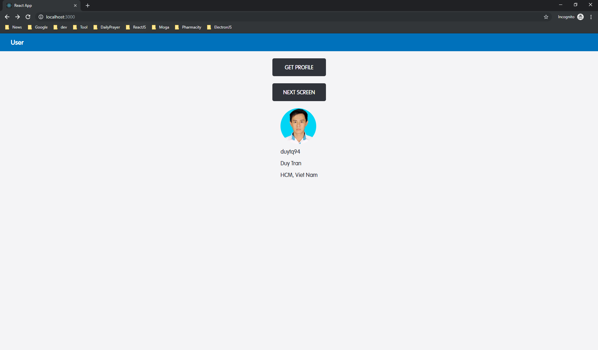
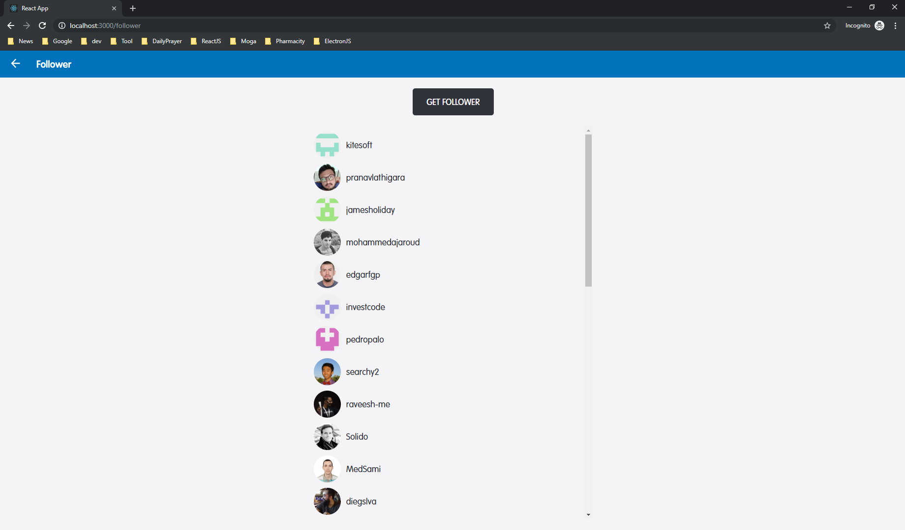
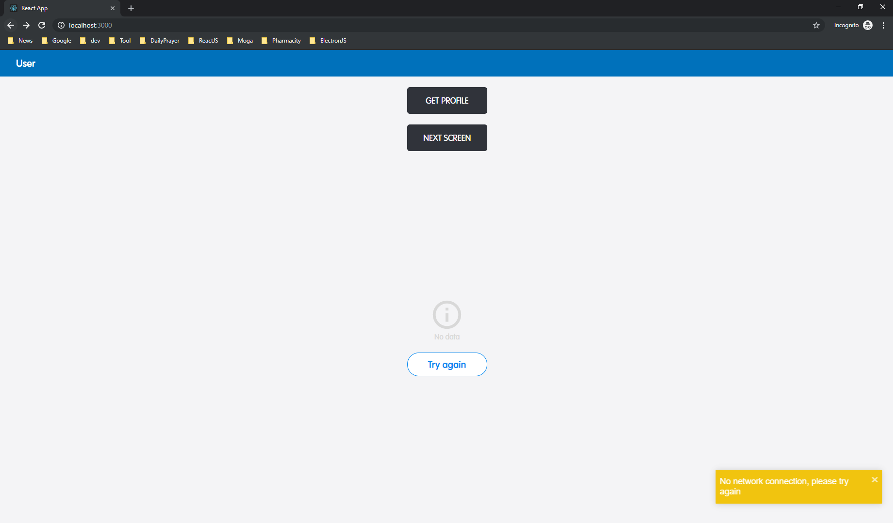

# ReactJS Template

## Description:
* Template project with Redux, Saga, React Router.

## How to run:
* Clone this project and at root project:
* Run `npm install` to install packages
* Run `npm start` to run the web on localhost

## Screenshots

